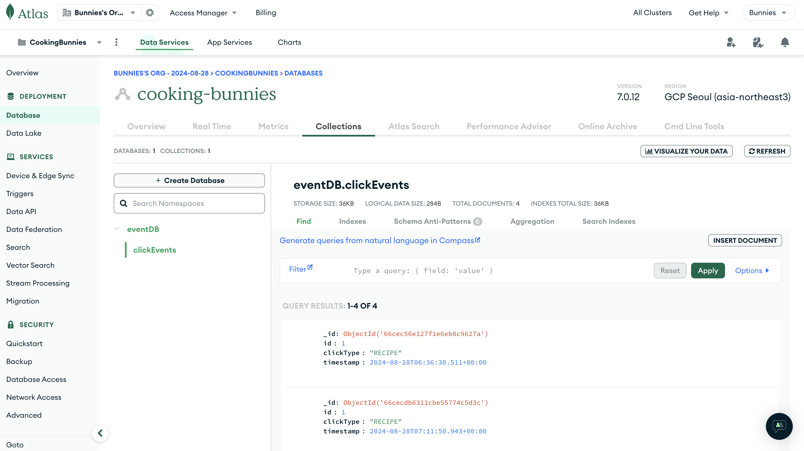
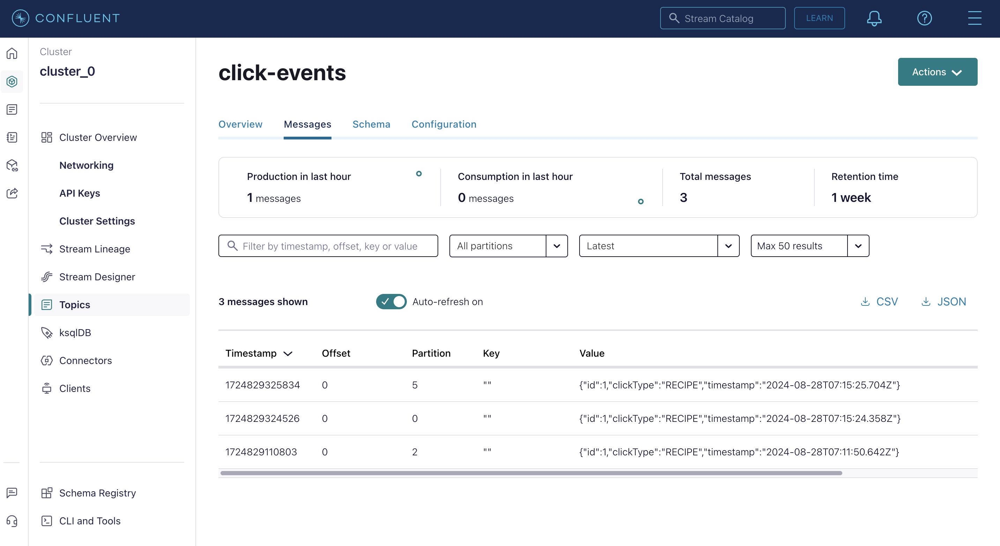

# 레시피 프로젝트의 이벤트 서버
이 프로젝트는 유저의 로그(특히 클릭 이벤트)를 수집하고 분석하여, 더 나은 사용자 경험을 제공하기 위한 이벤트 서버입니다. 
Kafka와 MongoDB를 활용하여 높은 트래픽에서도 안정적으로 데이터를 수집하고 저장할 수 있도록 설계되었습니다.

## 주요 기능

- **유저의 클릭 이벤트 수집 및 저장**: 사용자가 애플리케이션에서 클릭하는 모든 이벤트를 수집하여 MongoDB에 저장합니다.
- **Kafka를 통한 데이터 스트리밍**: 수집된 클릭 이벤트를 Kafka를 통해 스트리밍하여 실시간 데이터 처리와 분석을 가능하게 합니다.
- **RESTful API 제공**: 외부 시스템이나 클라이언트 애플리케이션에서 이벤트를 기록할 수 있도록 API 엔드포인트를 제공합니다.

## 기술 스택

- **Node.js LTS**: 비동기 이벤트 기반 서버 환경으로 빠른 요청 처리 및 확장성이 용이
- **KafkaJS 2.2.4**: Kafka를 JavaScript/Node.js 환경에서 쉽게 사용할 수 있도록 하는 라이브러리로, 데이터 스트리밍과 비동기 로그 전송을 처리
- **MongoDB 6.8.0**: 비정형 데이터를 유연하게 저장할 수 있는 NoSQL 데이터베이스로, 클릭 로그를 효율적으로 저장하고 검색할 수 있도록 사용

## 설치 및 실행 방법

1. **의존성 설치**:
   ```bash
   npm install
    ```
2. **환경 변수 설정**
```bash
   MONGODB_URI=mongodb://your-mongo-uri
    PORT=4000
    KAFKA_BROKERS=your-kafka-broker
    KAFKA_USERNAME=your-kafka-username
    KAFKA_PASSWO=your-kafka-password
   ```
3. **실행**
   ```bash
   node server.js
    ```
## 아키텍처 설명
- 사용자가 클릭 이벤트를 발생시키면, 해당 이벤트는 REST API를 통해 수집됩니다.
- 수집된 이벤트는 Kafka로 전송되어 실시간 데이터 처리 파이프라인에 들어갑니다.
- 동시에, 이벤트는 MongoDB에 저장되어 추후 분석 및 추천 시스템에 활용될 수 있도록 합니다.
## 사용 예시
클릭 이벤트를 기록하려면 다음과 같은 JSON 형식의 요청을 /api/click 엔드포인트로 POST 요청합니다.
```json
{
  "id": "1",
  "clickType": "RECIPE"
}
```
- 유저의 클릭 로그 저장


